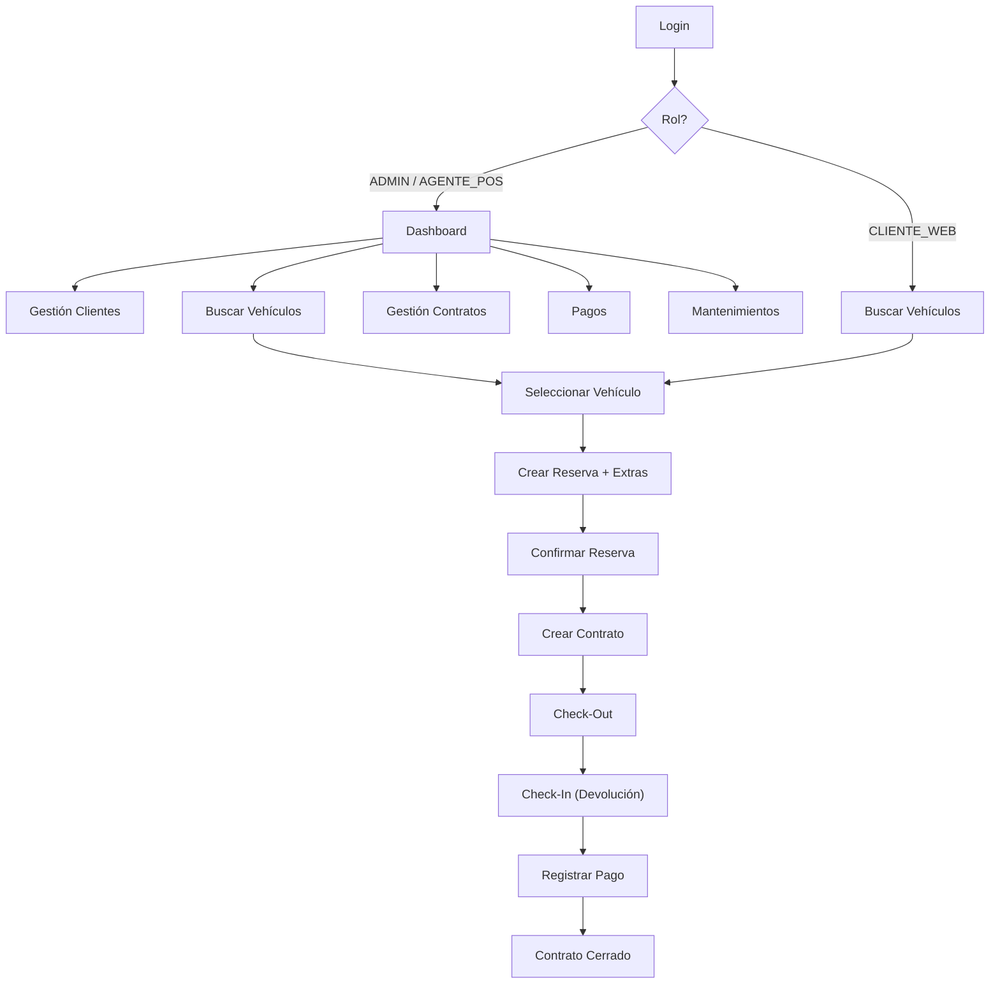

# 🚗 Plan de Implementación — Frontend React para Europcar Rental

## Contexto del Proyecto

| Componente | Detalle |
|---|---|
| **Backend** | .NET 8 API REST desplegada en **Render** |
| **Base de datos** | PostgreSQL en **Supabase** |
| **Autenticación** | JWT Bearer (60 min expiración) |
| **API Base URL** | `https://<tu-app>.onrender.com/api/v1` |
| **Roles** | `ADMIN`, `AGENTE_POS`, `CLIENTE_WEB` |

---

## 1. Stack Tecnológico Recomendado

| Librería | Propósito |
|---|---|
| **React 18+** con Vite | Framework UI + bundler rápido |
| **React Router v6** | Enrutamiento SPA |
| **Axios** | Cliente HTTP con interceptors JWT |
| **Zustand** o **Context API** | Estado global (auth, usuario) |
| **React Hook Form + Zod** | Formularios + validación |
| **TanStack Query (React Query)** | Cache, refetch, estados async |
| **date-fns** | Formateo de fechas |
| **Sonner / React Hot Toast** | Notificaciones |
| **Lucide React** | Iconos |

---

## 2. Estructura de Carpetas

```
europcar-frontend/
├── public/
├── src/
│   ├── api/                  # Capa HTTP
│   │   ├── axiosClient.js    # Instancia Axios + interceptors
│   │   ├── authApi.js
│   │   ├── clientesApi.js
│   │   ├── vehiculosApi.js
│   │   ├── reservasApi.js
│   │   ├── contratosApi.js
│   │   ├── pagosApi.js
│   │   ├── mantenimientosApi.js
│   │   └── catalogosApi.js
│   ├── components/           # Componentes reutilizables
│   │   ├── ui/               # Botones, inputs, modals, tables
│   │   ├── layout/           # Sidebar, Header, Footer
│   │   └── shared/           # StatusBadge, LoadingSpinner, etc.
│   ├── hooks/                # Custom hooks
│   ├── pages/                # Vistas por módulo
│   │   ├── auth/
│   │   ├── dashboard/
│   │   ├── clientes/
│   │   ├── vehiculos/
│   │   ├── reservas/
│   │   ├── contratos/
│   │   ├── pagos/
│   │   └── mantenimientos/
│   ├── store/                # Estado global (auth)
│   ├── utils/                # Helpers, formatters, constants
│   ├── routes/               # Configuración de rutas + guards
│   ├── App.jsx
│   ├── main.jsx
│   └── index.css
├── .env
├── package.json
└── vite.config.js
```

---

## 3. Inventario Completo de Endpoints API

### 3.1 Auth (público)

| Método | Ruta | Descripción | Request | Response |
|---|---|---|---|---|
| `POST` | `/auth/login` | Login JWT | `{ username, password }` | `{ token, username, correo, roles[], expiration }` |

### 3.2 Clientes (requiere JWT, roles: ADMIN / AGENTE_POS)

| Método | Ruta | Descripción |
|---|---|---|
| `GET` | `/clientes` | Listar todos los clientes activos |
| `GET` | `/clientes/{id}` | Obtener cliente por ID |
| `POST` | `/clientes` | Crear cliente |
| `PUT` | `/clientes/{id}` | Actualizar cliente |
| `DELETE` | `/clientes/{id}` | Soft-delete (solo ADMIN) |

### 3.3 Vehículos (requiere JWT)

| Método | Ruta | Descripción |
|---|---|---|
| `GET` | `/vehiculos/disponibles?localizacionId&categoriaId` | Buscar disponibles |
| `GET` | `/vehiculos/{id}` | Detalle de un vehículo |

### 3.4 Reservas (requiere JWT)

| Método | Ruta | Descripción |
|---|---|---|
| `POST` | `/reservas` | Crear reserva (con extras opcionales) |
| `GET` | `/reservas/{codigo}` | Obtener reserva por código |
| `GET` | `/reservas/cliente/{idCliente}` | Reservas de un cliente |
| `PUT` | `/reservas/{id}/confirmar` | Confirmar (ADMIN/AGENTE_POS) |
| `PUT` | `/reservas/{id}/cancelar` | Cancelar reserva |

### 3.5 Contratos (requiere JWT, roles: ADMIN / AGENTE_POS)

| Método | Ruta | Descripción |
|---|---|---|
| `GET` | `/contratos` | Listar todos los contratos |
| `GET` | `/contratos/{id}` | Detalle de contrato |
| `POST` | `/contratos` | Crear desde reserva confirmada |
| `POST` | `/contratos/checkout` | Registrar check-out |
| `POST` | `/contratos/checkin` | Registrar check-in (devolución) |

### 3.6 Pagos (requiere JWT, roles: ADMIN / AGENTE_POS)

| Método | Ruta | Descripción |
|---|---|---|
| `GET` | `/pagos/{id}` | Obtener pago por ID |
| `GET` | `/pagos/reserva/{idReserva}` | Pagos por reserva |
| `POST` | `/pagos` | Registrar pago |

### 3.7 Mantenimientos (requiere JWT, roles: ADMIN / AGENTE_POS)

| Método | Ruta | Descripción |
|---|---|---|
| `GET` | `/mantenimientos/{id}` | Obtener por ID |
| `GET` | `/mantenimientos/vehiculo/{idVehiculo}` | Por vehículo |
| `POST` | `/mantenimientos` | Crear mantenimiento |
| `PUT` | `/mantenimientos/{id}/cerrar` | Cerrar mantenimiento |

### 3.8 Catálogos (requiere JWT)

| Método | Ruta | Descripción |
|---|---|---|
| `GET` | `/catalogos/localizaciones` | Sucursales activas |
| `GET` | `/catalogos/localizaciones/{id}` | Detalle sucursal |
| `GET` | `/catalogos/categorias` | Categorías de vehículos |
| `GET` | `/catalogos/marcas` | Marcas de vehículos |
| `GET` | `/catalogos/extras` | Extras disponibles |

### 3.9 Booking (público, sin JWT)

| Método | Ruta | Descripción |
|---|---|---|
| `GET` | `/vehiculos?idLocalizacion&fechaRecogida&fechaDevolucion&...` | Búsqueda paginada |
| `GET` | `/vehiculos/{vehiculoId}` | Detalle vehículo |
| `GET` | `/vehiculos/{vehiculoId}/disponibilidad?...` | Disponibilidad real-time |
| `GET` | `/localizaciones?idCiudad&page&limit` | Localizaciones paginadas |
| `GET` | `/localizaciones/{id}` | Detalle localización |
| `GET` | `/categorias` | Categorías |
| `GET` | `/extras` | Extras con precios |

---

## 4. Formato de Respuestas API

### Respuesta exitosa (endpoints internos)
```json
{
  "success": true,
  "message": "Operación exitosa",
  "data": { ... },
  "timestamp": "2026-04-26T00:00:00Z"
}
```

### Respuesta de error
```json
{
  "success": false,
  "message": "Descripción del error",
  "detail": "Detalle técnico (solo en 500)",
  "statusCode": 400,
  "timestamp": "2026-04-26T00:00:00Z"
}
```

### Respuesta Booking (endpoints públicos)
```json
{
  "status": 200,
  "mensaje": "Operación exitosa",
  "data": { "vehiculos": [...], "paginacion": {...}, "_links": {...} }
}
```

---

## 5. Fases de Implementación

### Fase 1 — Fundación (Semana 1)

> [!IMPORTANT]
> Esta fase es la base. Sin ella, nada más funciona.

| # | Tarea | Prioridad |
|---|---|---|
| 1.1 | Crear proyecto con `npx create-vite` + configurar `.env` con API URL de Render | 🔴 |
| 1.2 | Configurar `axiosClient.js` con base URL, interceptor JWT y manejo de 401 | 🔴 |
| 1.3 | Implementar store de autenticación (token, usuario, roles) | 🔴 |
| 1.4 | Crear página de **Login** con formulario | 🔴 |
| 1.5 | Implementar `ProtectedRoute` y `RoleGuard` | 🔴 |
| 1.6 | Crear layout principal (Sidebar + Header + Content) | 🔴 |
| 1.7 | Sistema de diseño base: variables CSS, tipografía, componentes UI | 🔴 |

#### Detalle Técnico — Axios Client

```javascript
// src/api/axiosClient.js
import axios from 'axios';

const api = axios.create({
  baseURL: import.meta.env.VITE_API_URL, // https://<app>.onrender.com/api/v1
  headers: { 'Content-Type': 'application/json' }
});

api.interceptors.request.use(config => {
  const token = localStorage.getItem('token');
  if (token) config.headers.Authorization = `Bearer ${token}`;
  return config;
});

api.interceptors.response.use(
  res => res,
  error => {
    if (error.response?.status === 401) {
      localStorage.clear();
      window.location.href = '/login';
    }
    return Promise.reject(error);
  }
);

export default api;
```

#### Detalle Técnico — Auth Store

```javascript
// src/store/useAuthStore.js
import { create } from 'zustand';

export const useAuthStore = create((set) => ({
  token: localStorage.getItem('token') || null,
  user: JSON.parse(localStorage.getItem('user') || 'null'),
  isAuthenticated: !!localStorage.getItem('token'),

  login: (loginResponse) => {
    localStorage.setItem('token', loginResponse.token);
    localStorage.setItem('user', JSON.stringify({
      username: loginResponse.username,
      correo: loginResponse.correo,
      roles: loginResponse.roles,
      expiration: loginResponse.expiration
    }));
    set({ token: loginResponse.token, user: loginResponse, isAuthenticated: true });
  },

  logout: () => {
    localStorage.clear();
    set({ token: null, user: null, isAuthenticated: false });
  },

  hasRole: (role) => {
    const user = JSON.parse(localStorage.getItem('user') || '{}');
    return user.roles?.includes(role) || false;
  }
}));
```

---

### Fase 2 — CRUD de Clientes (Semana 1-2)

| # | Tarea |
|---|---|
| 2.1 | Tabla de clientes con datos del `GET /clientes` |
| 2.2 | Modal/página para crear cliente (`POST /clientes`) |
| 2.3 | Modal/página para editar cliente (`PUT /clientes/{id}`) |
| 2.4 | Acción de eliminar con confirmación (`DELETE /clientes/{id}`) |
| 2.5 | Filtro/búsqueda local en tabla |

#### Campos del Formulario Cliente

| Campo | Tipo | Requerido | Validación |
|---|---|---|---|
| `tipoIdentificacion` | Select | ✅ | `DNI`, `PAS`, `RUC`, `CED` |
| `numeroIdentificacion` | Text | ✅ | Max 20 chars |
| `nombre1` | Text | ✅ | Max 80 chars |
| `nombre2` | Text | ❌ | Max 80 chars |
| `apellido1` | Text | ✅ | Max 80 chars |
| `apellido2` | Text | ❌ | Max 80 chars |
| `fechaNacimiento` | Date | ✅ | Mínimo 18 años |
| `telefono` | Text | ✅ | Max 20 chars |
| `correo` | Email | ✅ | Max 120 chars |
| `direccionPrincipal` | Text | ❌ | Max 200 chars |

---

### Fase 3 — Vehículos y Catálogos (Semana 2)

| # | Tarea |
|---|---|
| 3.1 | Página de vehículos disponibles con filtros (localización, categoría) |
| 3.2 | Tarjetas de vehículo con imagen, specs, precio/día |
| 3.3 | Vista detalle de vehículo |
| 3.4 | Cargar catálogos (localizaciones, categorías, marcas, extras) para los selects |

---

### Fase 4 — Reservas (Semana 2-3)

| # | Tarea |
|---|---|
| 4.1 | Flujo de nueva reserva: seleccionar cliente → vehículo → fechas → extras → confirmar |
| 4.2 | Lista de reservas por cliente |
| 4.3 | Detalle de reserva con desglose de costos y extras |
| 4.4 | Acciones: confirmar / cancelar reserva |
| 4.5 | Cálculo de subtotal en frontend (preview antes de enviar) |

#### Request de Crear Reserva
```json
{
  "idCliente": 1,
  "idVehiculo": 5,
  "idLocalizacionRecogida": 1,
  "idLocalizacionDevolucion": 2,
  "canalReserva": "WEB",
  "fechaHoraRecogida": "2026-05-01T09:00:00-05:00",
  "fechaHoraDevolucion": "2026-05-05T09:00:00-05:00",
  "extras": [
    { "idExtra": 1, "cantidad": 1 },
    { "idExtra": 3, "cantidad": 2 }
  ]
}
```

---

### Fase 5 — Contratos y Operaciones (Semana 3)

| # | Tarea |
|---|---|
| 5.1 | Lista de contratos con estado (ABIERTO, CERRADO, ANULADO) |
| 5.2 | Crear contrato desde reserva confirmada |
| 5.3 | Formulario de Check-Out (km, combustible, observaciones) |
| 5.4 | Formulario de Check-In / devolución (cargos adicionales) |
| 5.5 | Vista detalle de contrato con timeline de operaciones |

---

### Fase 6 — Pagos (Semana 3-4)

| # | Tarea |
|---|---|
| 6.1 | Registrar pago (asociado a reserva o contrato) |
| 6.2 | Historial de pagos por reserva |
| 6.3 | Detalle de pago |

---

### Fase 7 — Mantenimientos (Semana 4)

| # | Tarea |
|---|---|
| 7.1 | Registrar mantenimiento de vehículo |
| 7.2 | Listar mantenimientos por vehículo |
| 7.3 | Cerrar mantenimiento (devolver vehículo a disponible) |

---

### Fase 8 — Dashboard y Polish (Semana 4)

| # | Tarea |
|---|---|
| 8.1 | Dashboard con KPIs (reservas activas, vehículos disponibles, contratos abiertos) |
| 8.2 | Gráficos de ocupación |
| 8.3 | Responsive design para tablets |
| 8.4 | Manejo de loading states y empty states |
| 8.5 | Deploy a **Vercel** o **Netlify** |

---

## 6. Mapa de Rutas del Frontend

```
/login                          → Público
/dashboard                      → ADMIN, AGENTE_POS
/clientes                       → ADMIN, AGENTE_POS
/clientes/nuevo                 → ADMIN, AGENTE_POS
/clientes/:id                   → ADMIN, AGENTE_POS
/clientes/:id/editar            → ADMIN, AGENTE_POS
/vehiculos                      → Todos autenticados
/vehiculos/:id                  → Todos autenticados
/reservas                       → Todos autenticados
/reservas/nueva                 → Todos autenticados
/reservas/:codigo               → Todos autenticados
/contratos                      → ADMIN, AGENTE_POS
/contratos/:id                  → ADMIN, AGENTE_POS
/contratos/checkout             → ADMIN, AGENTE_POS
/contratos/checkin              → ADMIN, AGENTE_POS
/pagos                          → ADMIN, AGENTE_POS
/mantenimientos                 → ADMIN, AGENTE_POS
```

---

## 7. Configuración CORS (acción requerida en backend)

> [!WARNING]
> Actualmente el CORS está configurado con `https://tu-futuro-frontend.com`. Debes actualizar el backend en Render para permitir el dominio del frontend.

En `ServiceCollectionExtensions.cs`, línea 155, cambiar a:
```csharp
builder.WithOrigins(
    "https://tu-frontend.vercel.app",
    "http://localhost:5173"  // dev local
)
```

---

## 8. Variables de Entorno (.env)

```env
VITE_API_URL=https://<tu-app>.onrender.com/api/v1
VITE_APP_NAME=Europcar Rental
```

---

## 9. Usuarios de Prueba Disponibles

| Usuario | Password | Rol | Permisos |
|---|---|---|---|
| `admin.dev` | `12345` | ADMIN | Todo |
| `agente.pos` | `12345` | AGENTE_POS | CRUD clientes, reservas, contratos, pagos |
| `cliente.web` | `12345` | CLIENTE_WEB | Consultar vehículos, mis reservas |

---

## 10. Diagrama de Flujo Principal



---

## Resumen de Prioridad

| Fase | Semana | Crítica |
|---|---|---|
| **1. Fundación + Auth** | 1 | 🔴 Bloqueante |
| **2. CRUD Clientes** | 1-2 | 🔴 Core |
| **3. Vehículos + Catálogos** | 2 | 🔴 Core |
| **4. Reservas** | 2-3 | 🔴 Core |
| **5. Contratos** | 3 | 🟡 Importante |
| **6. Pagos** | 3-4 | 🟡 Importante |
| **7. Mantenimientos** | 4 | 🟢 Complementario |
| **8. Dashboard + Deploy** | 4 | 🟢 Complementario |
