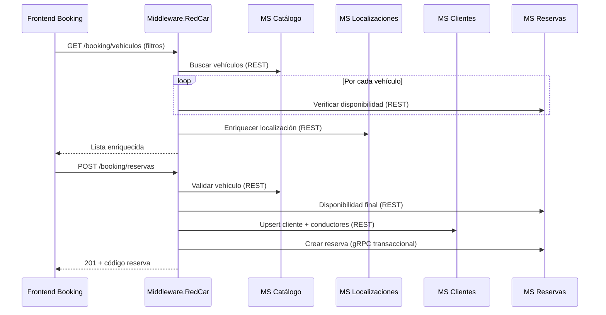
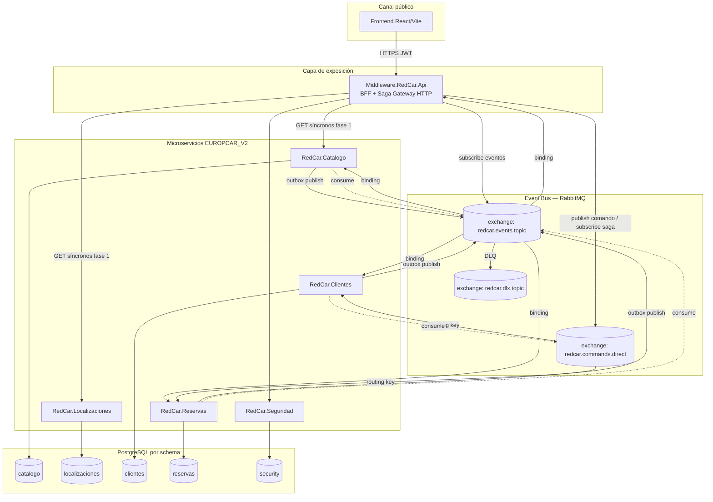
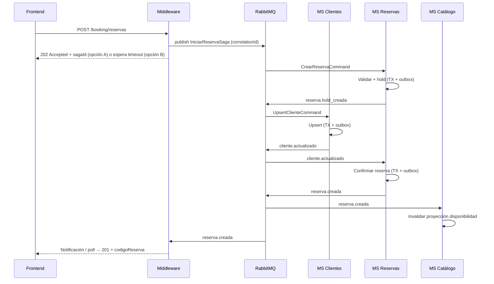
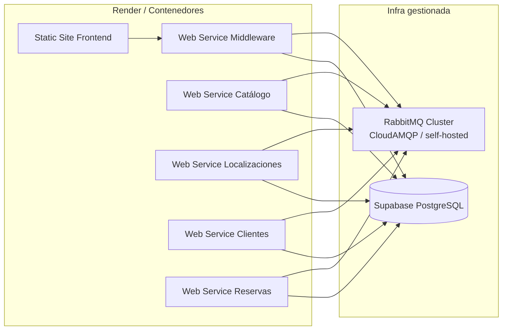

# Migración ESB → Event Bus (EvB) con RabbitMQ  
## Plataforma RedCar / Europcar — Canal Marketplace (Booking)

| Metadato | Valor |
|----------|--------|
| **Versión del documento** | 1.0 |
| **Fecha** | 4 de junio de 2026 |
| **Alcance** | Fundamentos teóricos, criterios técnicos, mejores prácticas y arquitectura objetivo |
| **Broker objetivo** | [RabbitMQ](https://www.rabbitmq.com/) |
| **Restricción** | Documento de diseño — **sin cambios de código** en este entregable |

---

## Tabla de contenidos

1. [Resumen ejecutivo](#1-resumen-ejecutivo)
2. [Situación actual (ESB de facto)](#2-situación-actual-esb-de-facto)
3. [Fundamentos teóricos](#3-fundamentos-teóricos)
4. [Criterios técnicos de migración](#4-criterios-técnicos-de-migración)
5. [Mejores prácticas con RabbitMQ](#5-mejores-prácticas-con-rabbitmq)
6. [Microservicios a actualizar (Marketplace)](#6-microservicios-a-actualizar-marketplace)
7. [Catálogo de eventos de dominio](#7-catálogo-de-eventos-de-dominio)
8. [Arquitectura objetivo del Event Bus](#8-arquitectura-objetivo-del-event-bus)
9. [Estrategia de migración por fases](#9-estrategia-de-migración-por-fases)
10. [Riesgos, métricas y criterios de aceptación](#10-riesgos-métricas-y-criterios-de-aceptación)
11. [Referencias](#11-referencias)

---

## 1. Resumen ejecutivo

Hoy el **canal Marketplace** (booking público `/api/v2/booking/...` y compat `/api/v1/...`) depende de **orquestación síncrona** centralizada en `Middleware.RedCar`: un patrón de **Enterprise Service Bus (ESB) ligero** implementado como **BFF + orquestadores** (`MarketplaceOrchestrator`, `ReservaOrchestrator`, `FacturaOrchestrator`) que encadenan llamadas **REST** y **gRPC** hacia cinco dominios (`Catálogo`, `Localizaciones`, `Clientes`, `Reservas`, `Seguridad`).

La migración propuesta sustituye progresivamente esa **integración acoplada en tiempo** por un **Event Bus (EvB)** basado en **mensajería asíncrona** con **RabbitMQ**, manteniendo el middleware como **fachada HTTP** para el frontend pero delegando los **procesos de negocio multi-dominio** a **eventos de dominio**, **consumidores idempotentes** y, donde aplique, **sagas** o **coreografías**.

**Beneficios esperados en Marketplace:**

- Desacoplamiento temporal entre MS (menos cascadas de timeout 502/504 en Render).
- Escalado independiente de lecturas (catálogo) frente a escrituras (reservas).
- Trazabilidad de procesos de reserva como flujo de eventos auditables.
- Evolución de contratos sin romper todos los consumidores a la vez (versionado de eventos).

**Principio rector:** *Strangler Fig* — el EvB convive con HTTP/gRPC hasta retirar rutas orquestadas una a una.

---

## 2. Situación actual (ESB de facto)

### 2.1. Componentes relevantes

| Componente | Rol actual | Protocolo hacia MS |
|------------|------------|----------------------|
| `Middleware.RedCar.Api` | API pública, JWT, Swagger | — |
| `MarketplaceOrchestrator` | Búsqueda vehículos, localizaciones, categorías, extras | REST → Catálogo, Localizaciones, Reservas |
| `ReservaOrchestrator` | Disponibilidad, crear/cancelar reserva | REST + **gRPC** → Catálogo, Clientes, Reservas |
| `FacturaOrchestrator` | Consulta factura por código reserva | REST → Reservas |
| `RedCar.Seguridad` | Auth (embebido en middleware en prod típica) | SQL directo en middleware |
| MS `Reservas` | Ya hace **enriquecimiento HTTP opcional** hacia Catálogo (`Downstream:CatalogoUrl`) | Acoplamiento punto a punto |

### 2.2. Flujos Marketplace que hoy “pegan” varios MS



### 2.3. Por qué se considera ESB (aunque no sea un producto ESB clásico)

| Característica ESB clásica | Equivalente en RedCar hoy |
|----------------------------|---------------------------|
| Hub central de integración | `Middleware.RedCar` |
| Transformación de mensajes | Mappers (`*BusinessMapper`) |
| Enrutamiento | Orquestadores por endpoint |
| Protocol mediation | REST + gRPC hacia MS |
| Acoplamiento temporal fuerte | Cadena síncrona en crear reserva y búsqueda N+1 disponibilidad |

El **EvB** no elimina el middleware como **API Gateway/BFF**, pero **sí** debe reducir su rol de **orquestador transaccional** en favor de **publicación/consumo de eventos** y **consultas de lectura** optimizadas.

---

## 3. Fundamentos teóricos

### 3.1. ESB vs Event Bus (EvB)

| Dimensión | ESB (integración orientada a servicios) | Event Bus (integración orientada a eventos) |
|-----------|----------------------------------------|---------------------------------------------|
| **Unidad de integración** | Mensaje/solicitud de servicio | Hecho de dominio ocurrido (`ReservaCreada`) |
| **Acoplamiento** | Conocimiento del endpoint y contrato síncrono | Conocimiento del tipo de evento y esquema |
| **Temporalidad** | Request/response en la misma ventana | Productor y consumidor desacoplados en el tiempo |
| **Consistencia** | Fuerte en una sola transacción distribuida (difícil) | **Eventual**; compensaciones vía sagas |
| **Escalabilidad** | Escala el hub y todas las dependencias | Escala por cola/consumidor |
| **Evolución** | Cambios en el hub afectan muchos flujos | Nuevos consumidores sin tocar al productor |
| **Complejidad operativa** | Menor al inicio | Mayor (broker, DLQ, observabilidad, idempotencia) |

### 3.2. Arquitectura orientada a eventos (EDA)

Conceptos aplicables al Marketplace RedCar:

1. **Evento de dominio** — Algo que ya ocurrió en un bounded context (`reservas.reserva_creada`). Nombre en pasado, payload mínimo, identificador de correlación.
2. **Evento de integración** — Versión publicada al bus para otros contextos (puede ser subset del dominio).
3. **Comando** — Intención de cambio (`CrearReservaCommand`); en RabbitMQ suele ir a una **cola de trabajo** dedicada, no a fan-out.
4. **Consulta (CQRS)** — Lecturas de catálogo/localizaciones pueden seguir síncronas o servirse desde **proyecciones** alimentadas por eventos.
5. **Coreografía vs orquestación**
   - **Coreografía:** cada MS reacciona a eventos sin coordinador central (ej. Catálogo invalida caché al recibir `ReservaConfirmada`).
   - **Orquestación:** un **Saga Coordinator** (puede vivir en Middleware o en un worker `RedCar.Sagas`) dirige pasos y compensaciones.

Para **crear reserva**, se recomienda **orquestación de saga** en fase inicial (menor riesgo que coreografía pura) y migrar a coreografía solo en pasos maduros.

### 3.3. Teorema CAP y consistencia en Marketplace

- En reserva de vehículos, **disponibilidad** es un recurso contencioso → riesgo de **condiciones de carrera**.
- El modelo actual mitiga con verificación final síncrona antes de `CrearReserva` (gRPC).
- Con EvB: usar **idempotencia** + **bloqueo optimista** o **hold temporal** (`ReservaHoldCreada` → `ReservaConfirmada` / `ReservaHoldExpirada`).
- Aceptar **consistencia eventual** en lecturas de listado (vehículos “casi disponibles”) si el UX muestra confirmación explícita en el paso de pago/reserva.

### 3.4. Patrones complementarios

| Patrón | Uso en RedCar + RabbitMQ |
|--------|--------------------------|
| **Transactional Outbox** | Persistir evento en la misma TX que la reserva en `schema reservas`, luego publicador los envía a RabbitMQ |
| **Inbox / idempotent consumer** | Tabla `inbox_events` por MS para no procesar dos veces el mismo `eventId` |
| **Dead Letter Queue (DLQ)** | Cola `*.dlq` tras N reintentos |
| **Correlation ID** | `correlationId` en headers AMQP = `TraceIdentifier` o `codigoReserva` |
| **Event versioning** | `eventType` + `schemaVersion` en envelope JSON |
| **Strangler Fig** | Mantener endpoints actuales; nuevos flujos detrás de feature flag |

### 3.5. RabbitMQ en el modelo lógico del EvB

RabbitMQ implementa el **EvB físico** mediante:

- **Exchanges** (enrutamiento): `topic` para eventos de dominio; `direct` para comandos por servicio.
- **Queues** (buffer + competencia de consumidores): una cola por **consumidor lógico**, no por evento.
- **Bindings** (reglas `routing key`): convención `redcar.<dominio>.<entidad>.<verbo>`.

No confundir **cola de trabajo** (un consumidor procesa) con **fan-out** (varios consumidores con colas propias ligadas al mismo exchange).

---

## 4. Criterios técnicos de migración

### 4.1. Criterios de selección de flujos candidatos

Priorizar migración al EvB cuando el flujo cumpla **≥2** de:

| # | Criterio |
|---|----------|
| C1 | Involucra **≥2 microservicios** en escritura |
| C2 | Tolerancia a latencia de **segundos** en la respuesta al usuario |
| C3 | Necesidad de **auditoría** o reproceso histórico |
| C4 | Picos de carga desiguales entre productor y consumidor |
| C5 | El acoplamiento síncrono genera **502/504** o timeouts en cadena (Render cold start) |

**Alta prioridad Marketplace:** `POST reservas` (C1, C2, C5), notificaciones post-reserva, invalidación de disponibilidad.  
**Baja prioridad inicial:** `GET categorías`, `GET localizaciones` (mantener REST; opcional cache por eventos).

### 4.2. Criterios de diseño de mensajes

| ID | Criterio | Regla |
|----|----------|-------|
| M1 | **Envelope estándar** | `{ "eventId", "eventType", "schemaVersion", "occurredAt", "correlationId", "causationId", "producer", "payload" }` |
| M2 | **Payload mínimo** | IDs y datos necesarios; evitar “god events” con joins de 5 tablas |
| M3 | **Inmutabilidad** | Los eventos no se editan; correcciones = nuevo evento `ReservaCorregida` |
| M4 | **Timezone** | `occurredAt` en UTC ISO-8601 |
| M5 | **PII** | No publicar contraseñas ni tokens; enmascarar documentos si el bus no es privado end-to-end |

### 4.3. Criterios de infraestructura RabbitMQ

| ID | Criterio | Recomendación |
|----|----------|---------------|
| R1 | **Alta disponibilidad** | Cluster 3 nodos o RabbitMQ en CloudAMQP / Amazon MQ según presupuesto |
| R2 | **TLS** | `amqps://` en producción |
| R3 | **Usuarios y vhosts** | `vhost /redcar-marketplace`; usuario por MS con permisos mínimos |
| R4 | **Política de colas** | `x-message-ttl` en holds; `x-dead-letter-exchange` hacia `redcar.dlx` |
| R5 | **Prefetch** | `prefetchCount` bajo (10–50) en consumidores .NET para back-pressure |
| R6 | **Persistencia** | Mensajes `deliveryMode=2` en eventos críticos de reserva |
| R7 | **Observabilidad** | Prometheus plugin + correlación OpenTelemetry (`traceparent` en headers) |

### 4.4. Criterios de implementación .NET (cuando se codifique)

| ID | Criterio |
|----|----------|
| N1 | Librería: **MassTransit.RabbitMQ** o **EasyNetQ** (equipo debe elegir una; MassTransit aporta sagas out-of-the-box) |
| N2 | Contratos compartidos en `EUROPCAR_V2/shared/RedCar.Shared.Events` (nuevo proyecto, sin referencias a EF) |
| N3 | Publicación solo vía **Outbox** desde capa `DataManagement` / transacción de negocio |
| N4 | Consumidores en `*.Api` como `IHostedService` o workers dedicados por MS |
| N5 | Tests de integración con **Testcontainers** (`rabbitmq:3-management`) |

### 4.5. Qué **no** migrar al EvB (criterios de exclusión)

- Lecturas simples de catálogo sin efecto colateral.
- Login JWT (`Seguridad`) — permanece síncrono salvo auditoría asíncrona opcional.
- Health checks y Swagger.
- Operaciones que requieren respuesta inmediata con **garantía fuerte** sin diseño de saga (hasta tener hold + confirmación).

---

## 5. Mejores prácticas con RabbitMQ

### 5.1. Topología recomendada para RedCar Marketplace

```
vhost: /redcar-marketplace

Exchanges (durables):
  redcar.events.topic     type=topic     # eventos de dominio
  redcar.commands.direct  type=direct    # comandos punto a punto
  redcar.dlx.topic        type=topic     # dead letter

Ejemplo routing keys:
  redcar.reservas.reserva.creada.v1
  redcar.reservas.reserva.cancelada.v1
  redcar.reservas.disponibilidad.consultada.v1
  redcar.clientes.cliente.actualizado.v1
  redcar.catalogo.vehiculo.estado_cambiado.v1
  redcar.localizaciones.localizacion.actualizada.v1
```

**Regla:** cada **servicio consumidor** declara su cola:

- `reservas.integration` ← binding `redcar.catalogo.vehiculo.#` (si necesita reaccionar)
- `catalogo.projection` ← binding `redcar.reservas.reserva.#`
- `middleware.saga.reservas` ← binding `redcar.reservas.#` + comandos directos

### 5.2. Tabla de decisiones Exchange / Queue

| Escenario | Exchange | Patrón |
|-----------|----------|--------|
| Un MS debe procesar comando | `direct` + cola `clientes.commands` | Competencia de consumidores |
| Varios MS reaccionan al mismo hecho | `topic` + una cola por MS | Fan-out con colas dedicadas |
| Retry con backoff | Cola principal + TTL DLX a `retry.30s` → re-bind | Delayed retry |
| Poison message | DLQ `*.dlq` + alerta | Operaciones manual |

### 5.3. Idempotencia y orden

- **Idempotencia:** clave natural = `eventId` (UUID v7 recomendado).
- **Orden:** RabbitMQ garantiza orden **por cola**, no global. Particionar por `idVehiculo` o `codigoReserva` si un mismo agregado debe procesarse en orden (consistent hash en routing key opcional).
- **Duplicados:** esperados; diseñar consumidores **at-least-once** → efecto **exactly-once** vía inbox.

### 5.4. Seguridad

- Credenciales por MS en variables `RabbitMQ__*`.
- Rotación de contraseñas y **separación** dev/staging/prod por vhost.
- No publicar JWT en mensajes; propagar `correlationId` y validar en consumidor si el evento exige contexto de usuario (preferir eventos con `idUsuario` / `idCliente` ya resueltos).

### 5.5. Observabilidad mínima viable

| Señal | Herramienta |
|-------|-------------|
| Profundidad de cola | RabbitMQ Management / Prometheus |
| Tasa publish/consume | OpenTelemetry metrics |
| Trazas distribuidas | `correlationId` + export OTLP |
| Log estructurado | `EventId`, `EventType`, `Consumer` en Serilog |

---

## 6. Microservicios a actualizar (Marketplace)

### 6.1. Matriz de impacto

| Microservicio | Prioridad EvB | Rol en Marketplace | Cambios esperados |
|---------------|---------------|--------------------|-------------------|
| **RedCar.Reservas** | **Crítica (P0)** | Disponibilidad, crear/cancelar reserva, factura | Productor principal: `ReservaCreada`, `ReservaCancelada`, `DisponibilidadRechazada`; Outbox; consumir eventos de Catálogo para validación async; reducir HTTP saliente a Catálogo |
| **RedCar.Clientes** | **Alta (P0)** | Upsert cliente/conductores en crear reserva | Consumidor de `CrearReservaSaga` o comando `UpsertClienteCommand`; productor `ClienteActualizado`, `ConductoresRegistrados` |
| **RedCar.Catalogo** | **Alta (P1)** | Vehículos, categorías, extras en búsqueda | Productor `VehiculoEstadoCambiado`, `VehiculoActualizado`; consumidor de reservas para proyección de disponibilidad/cache; opcional: API de lectura sin cambios |
| **RedCar.Localizaciones** | **Media (P2)** | Enriquecimiento en listados y detalle | Productor `LocalizacionActualizada` (baja frecuencia); consumidor opcional para materializar vistas en otros MS |
| **RedCar.Seguridad** | **Baja (P3)** | Auth del canal (embebido en MW) | Productor opcional `UsuarioAutenticado` / `IntentoLoginFallido` hacia `audit`; no bloquea Marketplace |
| **Middleware.RedCar** | **Alta (P0)** | BFF público | De orquestador síncrono a: publicar comando `IniciarReservaSaga`, suscribirse a eventos de finalización, polling/WebSocket opcional para UX; mantener GET síncronos en fase 1 |

### 6.2. Detalle por microservicio

#### MS Reservas (`RedCar.Reservas.*`)

**Motivo:** es el **agregado raíz** del proceso de booking y ya contiene lógica transaccional (gRPC `CrearReserva`).

| Área del proyecto | Actualización |
|-------------------|---------------|
| `DataAccess` | Tablas `outbox_messages`, `inbox_processed_events` |
| `DataManagement` | Publicar eventos en la misma transacción que persiste reserva |
| `Business` | Saga local: estados `PENDIENTE` → `CONFIRMADA` / `CANCELADA` |
| `Api` | Hosted consumers RabbitMQ; endpoint REST puede delegar a “aceptar comando” async |
| Config | `RabbitMQ__Host`, `Exchange__Events` |

**Eventos a publicar (mínimo viable):**

- `redcar.reservas.reserva.creada.v1`
- `redcar.reservas.reserva.cancelada.v1`
- `redcar.reservas.reserva.hold_expirada.v1` (si se implementa hold)

#### MS Clientes (`RedCar.Clientes.*`)

**Motivo:** hoy el middleware hace **upsert síncrono** antes de gRPC a Reservas.

| Cambio | Descripción |
|--------|-------------|
| Consumidor | Escucha `redcar.reservas.saga.cliente_requerido.v1` o comando directo con datos del booking |
| Productor | Emite `redcar.clientes.cliente.actualizado.v1` para que Reservas enlace `idCliente` |
| API REST | Mantener endpoints admin; booking puede dejar de llamar REST directo desde MW |

#### MS Catálogo (`RedCar.Catalogo.*`)

**Motivo:** validación de vehículo `DISPONIBLE` y datos de listado; Reservas ya llama por HTTP.

| Cambio | Descripción |
|--------|-------------|
| Productor | Cambios de estado de vehículo → evento (invalida suposiciones de disponibilidad) |
| Consumidor | `reserva.creada` / `cancelada` → actualizar proyección o caché distribuida |
| Lectura | `GET vehiculos` puede permanecer REST para el Middleware en fase 1 |

#### MS Localizaciones (`RedCar.Localizaciones.*`)

**Motivo:** principalmente **lectura** en Marketplace; bajo volumen de escritura.

| Cambio | Descripción |
|--------|-------------|
| Productor | Solo si hay CRUD admin que deba propagarse |
| Consumidor | Opcional para réplicas locales en otros MS |

#### MS Seguridad (`RedCar.Seguridad.*`)

**Motivo:** no está en el camino crítico del booking V2 salvo emisión de JWT.

| Cambio | Descripción |
|--------|-------------|
| EvB | Fase posterior: eventos de auditoría hacia cola `audit.integration` |

#### Middleware (`Middleware.RedCar.*`)

**Motivo:** hoy concentra el **ESB**.

| Cambio | Descripción |
|--------|-------------|
| `ReservaOrchestrator` | Evolucionar a **Saga Gateway**: POST devuelve `202 Accepted` + `sagaId` o mantiene 201 cuando saga completa en &lt;timeout configurable |
| `MarketplaceOrchestrator` | Fase 1 sin cambios en GET; fase 2 sustituir N llamadas disponibilidad por **proyección** `VehiculoDisponibilidadActualizada` |
| `DataAccess` | Cliente RabbitMQ publish-only + subscribe a `saga.completed` |
| Orquestación gRPC | Retirar gradualmente cuando Reservas exponga comando async equivalente |

### 6.3. Proyecto compartido nuevo (recomendado)

| Proyecto | Contenido |
|----------|-----------|
| `RedCar.Shared.Events` | Records C# / contratos JSON Schema de eventos y comandos Marketplace |
| `RedCar.Shared.Messaging` (opcional) | Envelope, headers AMQP, constantes de routing keys |

Sin referencias circulares: los MS **no** deben importar `Business` de otro MS.

### 6.4. Servicios de plataforma adicionales (no son MS de dominio)

| Componente | Función |
|------------|---------|
| **RabbitMQ cluster** | Broker EvB |
| **Outbox dispatcher** (worker por MS o librería) | Lee outbox y publica |
| **RedCar.Saga.Reservas** (opcional) | Coordinador si no se desea lógica saga en Middleware |

---

## 7. Catálogo de eventos de dominio

### 7.1. Eventos núcleo Marketplace (v1)

| Event type | Productor | Consumidores típicos | Dispara |
|------------|-----------|----------------------|---------|
| `reserva.iniciada` | Middleware / Reservas | Clientes, Reservas | POST booking reserva |
| `cliente.actualizado` | Clientes | Reservas | Tras upsert |
| `conductores.registrados` | Clientes | Reservas | Tras upsert conductores |
| `reserva.creada` | Reservas | Catálogo, Middleware, (notificaciones) | TX commit reserva |
| `reserva.cancelada` | Reservas | Catálogo, Middleware | PATCH cancelar |
| `reserva.rechazada` | Reservas | Middleware | Conflicto disponibilidad |
| `vehiculo.estado_cambiado` | Catálogo | Reservas | Admin baja vehículo |
| `disponibilidad.invalidada` | Reservas | Catálogo (proyección) | Tras crear/cancelar |

### 7.2. Comandos (cola direct, no fan-out)

| Command | Cola | Productor |
|---------|------|-----------|
| `CrearReservaCommand` | `reservas.commands` | Middleware |
| `UpsertClienteCommand` | `clientes.commands` | Saga / Middleware |
| `CancelarReservaCommand` | `reservas.commands` | Middleware |

---

## 8. Arquitectura objetivo del Event Bus

### 8.1. Vista de contenedores (C4 simplificado)



### 8.2. Flujo objetivo: crear reserva (saga orquestada)



### 8.3. Flujo objetivo: búsqueda de vehículos (híbrido)

| Fase | Comportamiento |
|------|----------------|
| **Fase 1** | Middleware sigue llamando REST a Catálogo + Reservas (sin cambio UX) |
| **Fase 2** | Catálogo mantiene proyección `vehiculo_disponibilidad` alimentada por `reserva.creada` / `cancelada` |
| **Fase 3** | Middleware lee una sola API o caché; elimina bucle N+1 a Reservas |

### 8.4. Diagrama de despliegue (Render / Docker)



> **Nota de despliegue:** RabbitMQ no sustituye PostgreSQL; cada MS conserva su **bounded context** y base. El bus solo transporta **hechos** y **comandos**.

---

## 9. Estrategia de migración por fases

| Fase | Duración orientativa | Entregable | Riesgo |
|------|----------------------|------------|--------|
| **0 — Fundaciones** | 1–2 sprints | RabbitMQ en dev, `RedCar.Shared.Events`, outbox en Reservas, observabilidad | Bajo |
| **1 — Publicar sin consumir** | 1 sprint | Reservas publica `reserva.creada` en shadow mode; middleware sigue síncrono | Bajo |
| **2 — Saga crear reserva** | 2–3 sprints | Clientes + Reservas por comandos; MW adapta POST | Medio |
| **3 — Proyección disponibilidad** | 2 sprints | Catálogo consume eventos; reduce llamadas N+1 | Medio |
| **4 — Cancelación y factura async** | 1–2 sprints | Eventos cancelación; factura puede seguir REST | Bajo |
| **5 — Retirar orquestación gRPC** | 1 sprint | Deprecar path gRPC desde MW si hay paridad comando | Alto si no hay tests |
| **6 — Seguridad / auditoría** | Opcional | Eventos login a cola audit | Bajo |

En cada fase: **feature flag** `EvB:Enabled`, pruebas de carga en búsqueda de vehículos, y **rollback** = desactivar flag y volver a orquestación síncrona.

---

## 10. Riesgos, métricas y criterios de aceptación

### 10.1. Riesgos principales

| Riesgo | Mitigación |
|--------|------------|
| Doble reserva (race) | Hold + confirmación; idempotency key en comando |
| Mensajes perdidos | Outbox + persistent messages + publisher confirms |
| Orden incorrecto | Una cola por agregado `codigoReserva` o saga state machine |
| Complejidad operativa | Runbooks DLQ, dashboards, alertas profundidad cola |
| Cold start Render + async | Timeout UX (202 + polling) o WebSocket saga status |

### 10.2. Métricas de éxito

| Métrica | Objetivo orientativo |
|---------|----------------------|
| p95 `POST /reservas` (UX percibido) | ≤ 3 s con saga async o ≤ 5 s síncrono en fase transición |
| Tasa error 502/504 middleware | −50 % vs baseline Render |
| Duplicados procesados sin efecto | 100 % idempotencia en consumidores P0 |
| Lag de consumo | p95 &lt; 2 s en `reservas.integration` |

### 10.3. Criterios de aceptación de la migración Marketplace

1. Crear reserva funciona con **Middleware + EvB** con paridad de contrato `{ status, mensaje, data }`.
2. Cancelar reserva emite `reserva.cancelada` y Catálogo refleja disponibilidad en &lt; 5 s (eventual).
3. Ningún MS accede al schema de otro MS (solo eventos + APIs públicas).
4. DLQ vacía en operación normal; procedimiento documentado de replay.
5. Trazas correlacionan `correlationId` desde HTTP hasta consumidor.

---

## 11. Referencias

| Recurso | Enlace / ubicación en repo |
|---------|----------------------------|
| Arquitectura middleware (ESB actual) | `Middleware.RedCar/README.md` |
| Microservicios y puertos | `EUROPCAR_V2/README.md` |
| Despliegue Render | `docs/RedCar-Render-Microservicios-y-Middleware.md` |
| RabbitMQ tutorials | https://www.rabbitmq.com/tutorials |
| Enterprise Integration Patterns | Hohpe & Woolf — Message Bus, Event Message |
| Transactional Outbox | https://microservices.io/patterns/data/transactional-outbox.html |
| MassTransit + RabbitMQ | https://masstransit.io/documentation/configuration/integrations/rabbitmq |

---

## Anexo A — Mapeo endpoints Marketplace → futuro EvB

| Endpoint Middleware | Orquestador actual | Integración objetivo |
|---------------------|-------------------|----------------------|
| `GET .../vehiculos` | Marketplace | REST fase 1 → proyección eventos fase 3 |
| `GET .../vehiculos/{id}` | Marketplace | REST |
| `GET .../reservas/{id}/disponibilidad` | Reserva | REST → evento consulta opcional |
| `GET .../localizaciones` | Marketplace | REST |
| `GET .../categorias`, `GET .../extras` | Marketplace | REST |
| `POST .../reservas` | Reserva | **Saga + RabbitMQ (P0)** |
| `GET/PATCH .../reservas/{codigo}` | Reserva | Eventos + REST lectura |
| `GET .../factura` | Factura | REST (baja prioridad async) |

---

## Anexo B — Glosario

| Término | Definición breve |
|---------|------------------|
| **ESB** | Bus de servicios empresarial; hub que integra aplicaciones con transformación y ruteo. |
| **EvB** | Bus de eventos; infraestructura pub/sub de hechos de dominio. |
| **BFF** | Backend for Frontend; API adaptada al canal web. |
| **Outbox** | Patrón que garantiza publicación atómica con persistencia local. |
| **Saga** | Transacción distribuida por pasos compensables. |
| **Routing key** | Clave AMQP que decide el enrutamiento en exchange `topic`. |

---

*Documento generado para el equipo RedCar / Europcar V2. Para implementación, abrir tareas por microservicio según la matriz de la sección 6 y validar contratos en `RedCar.Shared.Events` antes de codificar consumidores.*
